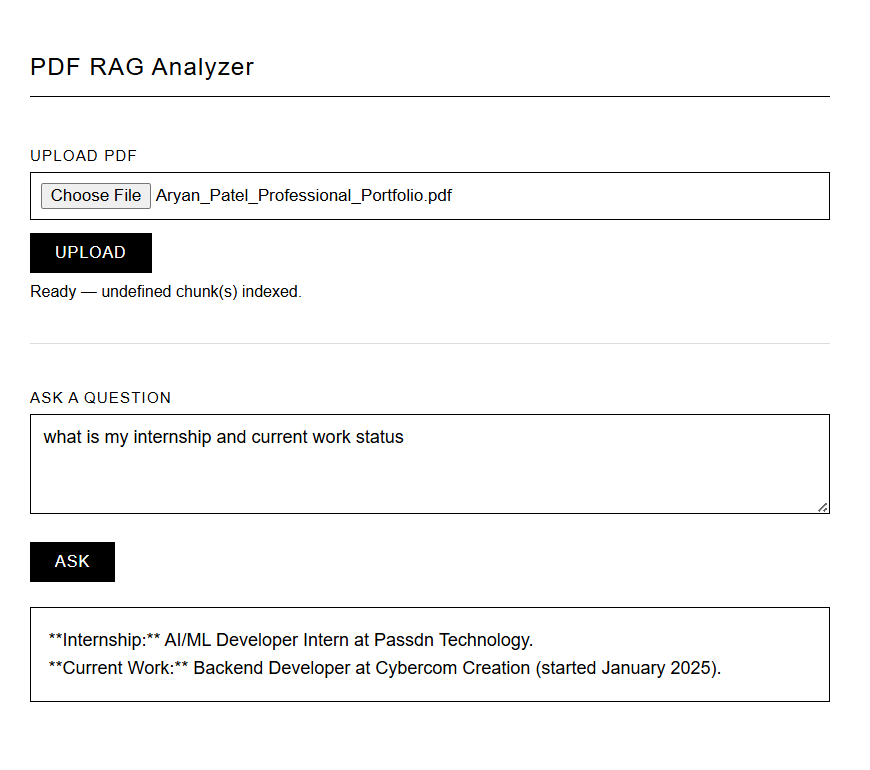

# PDF RAG Analyzer

A Retrieval-Augmented Generation (RAG) based PDF analyzer with a minimalist Flask web interface. Upload any PDF and ask questions — answers are grounded in the document content via semantic search + Gemini LLM.

---

## What is RAG?

RAG (Retrieval-Augmented Generation) is a technique that improves LLM responses by injecting relevant context retrieved from your own documents before generating an answer.

Instead of relying solely on the LLM's training data, RAG:

1. **Loads** your document and splits it into chunks
2. **Embeds** each chunk into a vector (numerical representation of meaning)
3. **Stores** those vectors in a vector database
4. At query time, **retrieves** the most semantically similar chunks to your question
5. **Passes** those chunks as context to the LLM to generate a grounded answer

```
PDF → Chunks → Embeddings → Vector Store
                                  ↓
Query → Query Embedding → Similarity Search → Top-K Chunks → LLM → Answer
```

This prevents hallucination and keeps answers scoped to your document.

---

## Project Structure

```
RAG/
├── app.py                  # Flask backend
├── documents.ipynb         # Original RAG notebook (research/dev)
├── requirements.txt
├── .env                    # GOOGLE_API_KEY
├── templates/
│   └── index.html          # Frontend UI
├── uploads/                # Temp PDF storage (auto-cleaned)
└── data/
    ├── pdf/                # Sample PDFs
    ├── txt/                # Sample text files
    ├── vector_store/       # ChromaDB persistent store (notebook)
    └── readme/
        └── responce_with_pdf.png
```

---

## RAG Pipeline (Notebook)

The notebook `documents.ipynb` walks through the full pipeline step by step:

| Step | Tool Used |
|---|---|
| Load PDFs | `PyMuPDFLoader`, `DirectoryLoader` |
| Split text | `RecursiveCharacterTextSplitter` (chunk=1000, overlap=200) |
| Generate embeddings | `SentenceTransformer` — `all-MiniLM-L6-v2` (384-dim) |
| Vector store | `ChromaDB` (persistent) |
| Retrieval | Cosine similarity search, top-K chunks |
| LLM | `gemini-2.5-flash` via `langchain-google-genai` |

---

## Flask App

The `app.py` wraps the same RAG pipeline into a web interface with two endpoints:

### `POST /upload`
- Accepts a PDF file
- Runs: load → split → embed → store in FAISS index (in-memory, per session)
- Returns a `session_id` tied to that PDF's index

### `POST /query`
- Accepts `session_id` + `query`
- Retrieves top-3 relevant chunks via FAISS inner product search
- Sends chunks as context to Gemini and returns the answer

### Run locally

```bash
pip install -r requirements.txt
python app.py
```

Open `http://127.0.0.1:5000`

---

## UI Preview



---

## Reference PDF

The sample PDF used for testing this RAG pipeline is included in the readme directory:

📄 [Aryan_Patel_Professional_Portfolio.pdf](data/readme/Aryan_Patel_Professional_Portfolio.pdf)

This is a 2-page professional portfolio document covering background, work experience, research projects, future vision, and personal interests. It was used to validate the retrieval and answer quality of the pipeline — for example, querying *"What are the personal interests and soft skills?"* correctly retrieves the relevant section and generates a grounded answer.

---

## Environment Setup

Create a `.env` file in the project root:

```
GOOGLE_API_KEY=your_api_key_here
```

Get your key from [Google AI Studio](https://aistudio.google.com/app/apikey).

---

## Dependencies

```
flask
python-dotenv
langchain
langchain-community
langchain-google-genai
langchain-text-splitters
pymupdf
pypdf
sentence-transformers
faiss-cpu
chromadb
numpy
scikit-learn
google-generativeai
```
